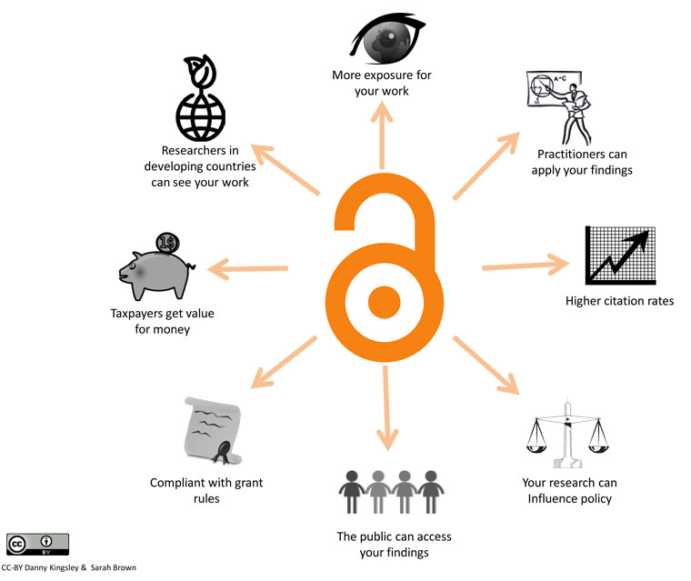

# Open Access

Open Access refers to online, free of cost access to research outputs, such as publications, with limited copyright and licensing restrictions so that anyone may read and reuse that research.

The [Budapest Open Access Initiative (BOAI)](http://www.budapestopenaccessinitiative.org/) was formed in response to the growing demand to make research free and available to anyone with a computer and an internet connection - the research process hinges on ensuring fast and widespread access to research findings such that all communities have the opportunity to build upon them and participate in scholarly conversations. The BOAI was the first initiative to use the term "Open Access", which it defined on February 14, 2002 as follows:
>By "open access" to [peer-reviewed research literature], we mean its free availability on the public internet, permitting any users to read, download, copy, distribute, print, search, or link to the full texts of these articles, crawl them for indexing, pass them as data to software, or use them for any other lawful purpose, without financial, legal, or technical barriers other than those inseparable from gaining access to the internet itself. The only constraint on reproduction and distribution, and the only role for copyright in this domain, should be to give authors control over the integrity of their work and the right to be properly acknowledged and cited.

Further major drivers behind Open Access relate to equality within and between communities, as well as bridging research divides between research cultures traditionally distant due to access restrictions (see [The academic, economic and societal impacts of Open Access: an evidence-based review](https://f1000research.com/articles/5-632/v3) for more information on the history of Open Access).

Open Access has been demonstrated to benefit researchers, science and society. Some of the benefits of Open Access are highlighted in the figure below.

These benefits have led to many funders now requiring outputs of the research they fund to be made available open access. For example, the [European Commission](http://ec.europa.eu/programmes/horizon2020/node/1031) requires all projects receiving Horizon 2020 funding to make sure that any peer-reviewed journal article they publish is open access to optimise the impact of publicly-funded scientific research.

There are 2 main routes to open access publishing: Gold and Green. 

The Gold route refers to making research articles freely accessible immediately upon publication by the publisher. This can be done by publishing through a fully Open Access journal (e.g., [PeerJ](https://peerj.com/) or a hybrid journal (which offers both Open Access and subscription content). This route often involves additional article processing charges (APCs), and are paid for by the University or research institute to which the researcher is affiliated, or by the funding agency supporting the research. This limits Gold Open Access publishing to institutions that can afford the APCs. Alternative business models will be needed to make publishing free and reusable content proliferate even further.

The Green route refers to publishing in a subscription based journal, but involves self-archiving of the peer-reviewed [Postprints](postprints.md) (and/or not peer-reviewed [Preprints](preprints.md)) by the authors in an institutional or external subject-based repository (try to avoid using a personal website which may lead to [reference rot](reference-rot.md)). No additional charges to the authors are incurred, but care needs to be taken on this route as journals and publishers may have [policies on self-archiving](sherpa.ac.uk/romeo) or require an [embargo](embargo.md) period before deposition in public repositories is allowed. This route may also still be restrictive in how people are allowed to share the research and redistribute it due to [Copyright](copyright.md), despite the fact that you can access the information in a postprint. The main problem is that [Copyright Transfer Agreements](copyright-transfer-agreements.md) often require the author to transfer *all* copyright. To promote permissive reuse of your research, read more about [Licensing](licensing.md).

## Exercises

* Consider what your definition of Open Access is. How does it compare to that of the Budapest Open Access Initiative?
* Talk with your direct supervisors or colleagues about what level of Open Access you'd be comfortable committing to for future manuscripts and other research outputs.

| Level | Commitment                                                                      |
|-------|---------------------------------------------------------------------------------|
| 0     | Encourage Open Access in new projects, but do not require it for collaboration  |
| 1     | Require Open Access in >=25% of your new projects                               |
| 2     | Require Open Access in >=50% of your new projects                               |
| 3     | Require Open Access in >=75% of your new projects                               |
| 4     | Require Open Access in 100% of your new projects                                |

* As a first step, consider making a poster or presentation Open Access on, for example, [Figshare](https://figshare.com/), [Zenodo](https://zenodo.org/) or the [Open Science Framework](https://osf.io/).

## Further reading:
  * [The academic, economic and societal impacts of Open Access: an evidence-based review](https://f1000research.com/articles/5-632/v3)
  * [Point of View: How open science helps researchers succeed](https://elifesciences.org/articles/16800)
