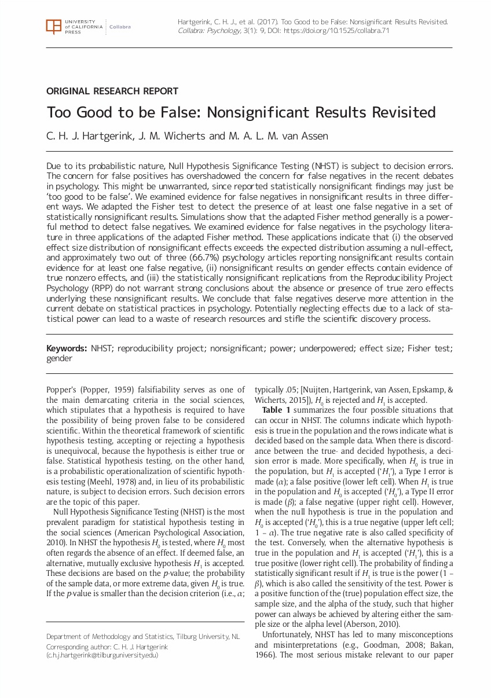

# Postprints

Postprints are free-to-read versions of accepted manuscripts after peer-review without paywalls. Specifically, postprints are the accepted but unformatted version of a manuscript. This means that the manuscript is not the typeset version from the publisher, but the author version from for example LaTeX or a word editor. A comparison is shown below.

<!-- Add images of unformatted and formatted for an open access paper -->

Due to [Copyright Transfer Agreements](copyright-transfer-agreements.md), sharing of postprints requires a bit more attention than the sharing of [Preprints](preprints.md). How much attention is needed, depends on the specific agreement and the policy of the journal. For most journals, the policy on postprints is included in the [SHeRPa/ROMEO](http://www.sherpa.ac.uk/romeo/index.php) database and is permissive after a specific [Embargo](embargo.md).

Some countries have laws that state that making postprints available is a moral right of the author, regardless of the journal policy and content of the [Copyright Transfer Agreements](copyright-transfer-agreements.md). These countries include the Netherlands, Germany, and France. Posting postprints is allowed after "a reasonable time" ([the Netherlands](http://wetten.overheid.nl/jci1.3:c:BWBR0001886&hoofdstuk=Ia&artikel=25fa&z=2017-09-01&g=2017-09-01)), which is often equated to twelve months (as is the case in [France](http://web.archive.org/web/20171121112449/https://www.openaire.eu/france-final-text-of-the-law-for-oa-has-been-adopted) and [Germany](https://www.gesetze-im-internet.de/englisch_urhg/englisch_urhg.html#p0241)).

Postprints are often shared in centralized repositories, instead of personal websites, to increase findability and persistency. If shared on a personal website, Google Scholar, oaDOI, and other services have trouble finding it and linking people to these free-to-read versions. Also, due to [content drift](), personal websites are not reliable for access. Many of these repositories to deposit postprints in are the same as the preprint servers. Many institutions also have repositories to deposit these.

Sharing postprints is a good first step in promoting availability of your work to interested readers, but still restricts how people may share that research and redistribute it. For example, posting an article in your course is still restricted due to [Copyright](copyright.md) even though you might be able to access the information in a postprint. To promote reuse of your research, read more about [Open Access publishing](open-access.md).

## Exercises

